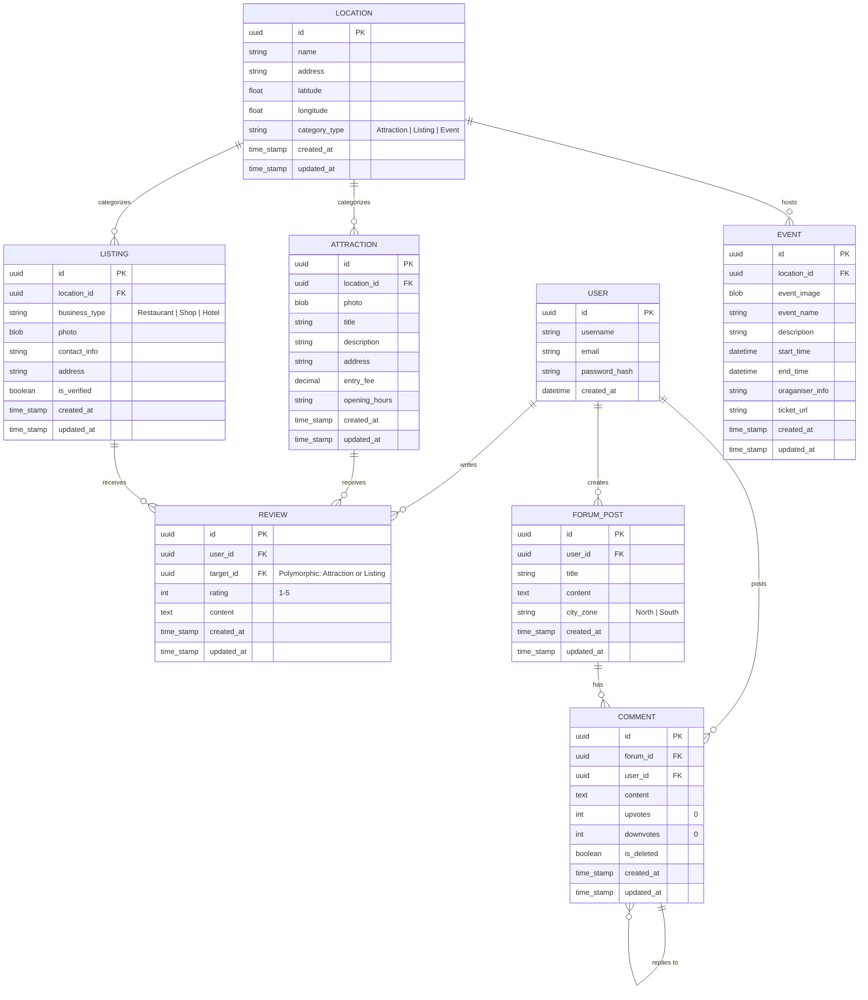
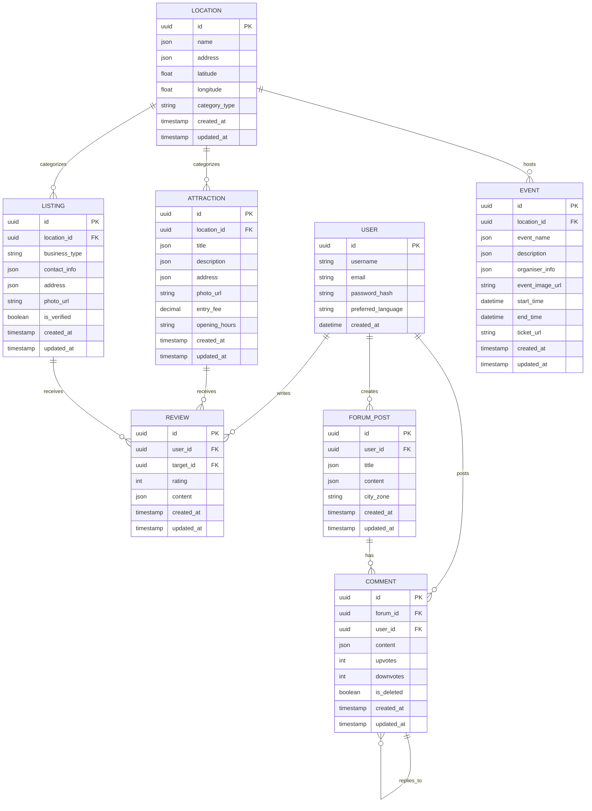
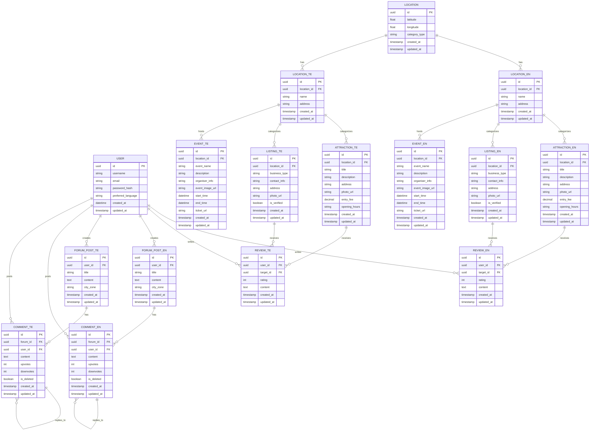

# Database Design

```mermaid
erDiagram
    USER ||--o{ REVIEW : writes
    USER ||--o{ FORUM_POST : creates
    USER ||--o{ COMMENT : posts
    
    LOCATION ||--o{ ATTRACTION : categorizes
    LOCATION ||--o{ LISTING : categorizes
    LOCATION ||--o{ EVENT : hosts
    
    ATTRACTION ||--o{ REVIEW : receives
    LISTING ||--o{ REVIEW : receives
    
    FORUM_POST ||--o{ COMMENT : has
    COMMENT ||--o{ COMMENT : "replies to"

    USER {
        uuid id PK
        string username
        string email
        string password_hash
        datetime created_at
    }

    LOCATION {
        uuid id PK
        string name
        string address
        float latitude
        float longitude
        string category_type "Attraction | Listing | Event"
        time_stamp created_at
        time_stamp updated_at
    }

    ATTRACTION {
        uuid id PK
        uuid location_id FK
        blob photo
        string title
        string description
        string address
        decimal entry_fee
        string opening_hours
        time_stamp created_at
        time_stamp updated_at
    }

    LISTING {
        uuid id PK
        uuid location_id FK
        string business_type "Restaurant | Shop | Hotel"
        blob photo
        string contact_info
        string address
        boolean is_verified
        time_stamp created_at
        time_stamp updated_at
    }

    EVENT {
        uuid id PK
        uuid location_id FK
        blob event_image
        string event_name
        string description
        datetime start_time
        datetime end_time
        string oraganiser_info
        string ticket_url
        time_stamp created_at
        time_stamp updated_at
    }

    REVIEW {
        uuid id PK
        uuid user_id FK
        uuid target_id FK "Polymorphic: Attraction or Listing"
        int rating "1-5"
        text content
        time_stamp created_at
        time_stamp updated_at
    }

    FORUM_POST {
        uuid id PK
        uuid user_id FK
        string title
        text content
        string city_zone "North | South"
        time_stamp created_at
        time_stamp updated_at
    }

    COMMENT {
        uuid id PK
        uuid forum_id FK
        uuid user_id FK
        text content
        int upvotes "0"
        int downvotes "0"
        boolean is_deleted 
        time_stamp created_at
        time_stamp updated_at
    }

```

# Translation Database Design (Method 1)

```mermaid
erDiagram
    USER ||--o{ REVIEW : writes
    USER ||--o{ FORUM_POST : creates
    USER ||--o{ COMMENT : posts
    
    LOCATION ||--o{ ATTRACTION : categorizes
    LOCATION ||--o{ LISTING : categorizes
    LOCATION ||--o{ EVENT : hosts
    
    ATTRACTION ||--o{ REVIEW : receives
    LISTING ||--o{ REVIEW : receives
    
    FORUM_POST ||--o{ COMMENT : has
    COMMENT ||--o{ COMMENT : replies_to

    USER {
        uuid id PK
        string username
        string email
        string password_hash
        string preferred_language
        datetime created_at
    }

    LOCATION {
        uuid id PK
        json name
        json address
        float latitude
        float longitude
        string category_type
        timestamp created_at
        timestamp updated_at
    }

    ATTRACTION {
        uuid id PK
        uuid location_id FK
        json title
        json description
        json address
        string photo_url
        decimal entry_fee
        string opening_hours
        timestamp created_at
        timestamp updated_at
    }

    LISTING {
        uuid id PK
        uuid location_id FK
        string business_type
        json contact_info
        json address
        string photo_url
        boolean is_verified
        timestamp created_at
        timestamp updated_at
    }

    EVENT {
        uuid id PK
        uuid location_id FK
        json event_name
        json description
        json organiser_info
        string event_image_url
        datetime start_time
        datetime end_time
        string ticket_url
        timestamp created_at
        timestamp updated_at
    }

    REVIEW {
        uuid id PK
        uuid user_id FK
        uuid target_id FK
        int rating
        json content
        timestamp created_at
        timestamp updated_at
    }

    FORUM_POST {
        uuid id PK
        uuid user_id FK
        json title
        json content
        string city_zone
        timestamp created_at
        timestamp updated_at
    }

    COMMENT {
        uuid id PK
        uuid forum_id FK
        uuid user_id FK
        json content
        int upvotes
        int downvotes
        boolean is_deleted
        timestamp created_at
        timestamp updated_at
    }
```

# Translation Database Design (Method 2)

```mermaid
    erDiagram
    USER ||--o{ REVIEW_EN : writes
    USER ||--o{ REVIEW_TE : writes
    USER ||--o{ FORUM_POST_EN : creates
    USER ||--o{ FORUM_POST_TE : creates
    USER ||--o{ COMMENT_EN : posts
    USER ||--o{ COMMENT_TE : posts

    LOCATION ||--o{ LOCATION_EN : has
    LOCATION ||--o{ LOCATION_TE : has

    LOCATION_EN ||--o{ ATTRACTION_EN : categorizes
    LOCATION_TE ||--o{ ATTRACTION_TE : categorizes

    LOCATION_EN ||--o{ LISTING_EN : categorizes
    LOCATION_TE ||--o{ LISTING_TE : categorizes

    LOCATION_EN ||--o{ EVENT_EN : hosts
    LOCATION_TE ||--o{ EVENT_TE : hosts

    ATTRACTION_EN ||--o{ REVIEW_EN : receives
    ATTRACTION_TE ||--o{ REVIEW_TE : receives

    LISTING_EN ||--o{ REVIEW_EN : receives
    LISTING_TE ||--o{ REVIEW_TE : receives

    FORUM_POST_EN ||--o{ COMMENT_EN : has
    FORUM_POST_TE ||--o{ COMMENT_TE : has

    COMMENT_EN ||--o{ COMMENT_EN : replies_to
    COMMENT_TE ||--o{ COMMENT_TE : replies_to


    USER {
        uuid id PK
        string username
        string email
        string password_hash
        string preferred_language
        datetime created_at
        timestamp updated_at
    }

    LOCATION {
        uuid id PK
        float latitude
        float longitude
        string category_type
        timestamp created_at
        timestamp updated_at
    }

    LOCATION_EN {
        uuid id PK
        uuid location_id FK
        string name
        string address
        timestamp created_at
        timestamp updated_at
    }

    LOCATION_TE {
        uuid id PK
        uuid location_id FK
        string name
        string address
        timestamp created_at
        timestamp updated_at
    }

    ATTRACTION_EN {
        uuid id PK
        uuid location_id FK
        string title
        string description
        string address
        string photo_url
        decimal entry_fee
        string opening_hours
        timestamp created_at
        timestamp updated_at
    }

    ATTRACTION_TE {
        uuid id PK
        uuid location_id FK
        string title
        string description
        string address
        string photo_url
        decimal entry_fee
        string opening_hours
        timestamp created_at
        timestamp updated_at
    }

    LISTING_EN {
        uuid id PK
        uuid location_id FK
        string business_type
        string contact_info
        string address
        string photo_url
        boolean is_verified
        timestamp created_at
        timestamp updated_at
    }

    LISTING_TE {
        uuid id PK
        uuid location_id FK
        string business_type
        string contact_info
        string address
        string photo_url
        boolean is_verified
        timestamp created_at
        timestamp updated_at
    }

    EVENT_EN {
        uuid id PK
        uuid location_id FK
        string event_name
        string description
        string organiser_info
        string event_image_url
        datetime start_time
        datetime end_time
        string ticket_url
        timestamp created_at
        timestamp updated_at
    }

    EVENT_TE {
        uuid id PK
        uuid location_id FK
        string event_name
        string description
        string organiser_info
        string event_image_url
        datetime start_time
        datetime end_time
        string ticket_url
        timestamp created_at
        timestamp updated_at
    }

    REVIEW_EN {
        uuid id PK
        uuid user_id FK
        uuid target_id FK
        int rating
        text content
        timestamp created_at
        timestamp updated_at
    }

    REVIEW_TE {
        uuid id PK
        uuid user_id FK
        uuid target_id FK
        int rating
        text content
        timestamp created_at
        timestamp updated_at
    }

    FORUM_POST_EN {
        uuid id PK
        uuid user_id FK
        string title
        text content
        string city_zone
        timestamp created_at
        timestamp updated_at
    }

    FORUM_POST_TE {
        uuid id PK
        uuid user_id FK
        string title
        text content
        string city_zone
        timestamp created_at
        timestamp updated_at
    }

    COMMENT_EN {
        uuid id PK
        uuid forum_id FK
        uuid user_id FK
        text content
        int upvotes
        int downvotes
        boolean is_deleted
        timestamp created_at
        timestamp updated_at
    }

    COMMENT_TE {
        uuid id PK
        uuid forum_id FK
        uuid user_id FK
        text content
        int upvotes
        int downvotes
        boolean is_deleted
        timestamp created_at
        timestamp updated_at
    }

```