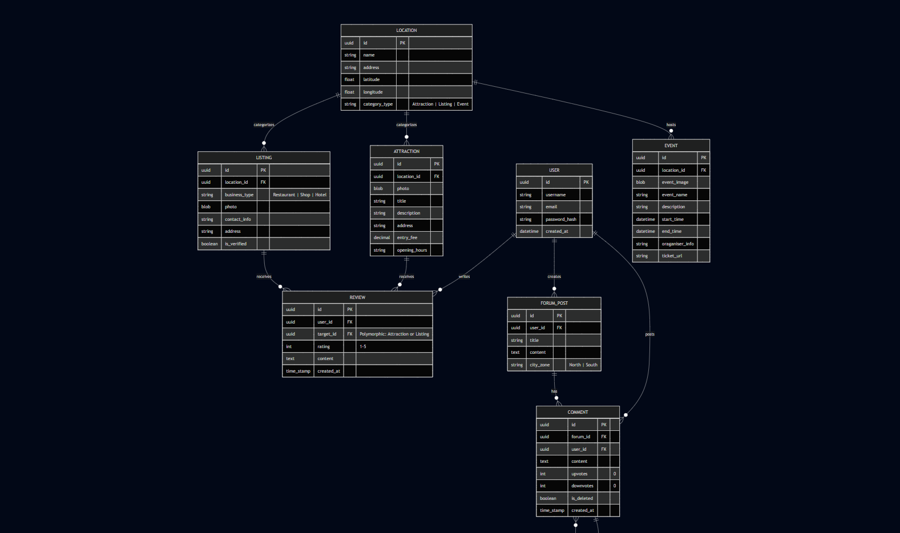

# Database Design

# API Design

## 1. API Endpoints (REST)

### Users
| Method | Endpoint | Body Parameters |
| :--- | :--- | :--- |
| `POST` | `/users` | `username`, `email`, `password_hash` |
| `GET` | `/users/:id` | - |

### Locations & Content
| Method | Endpoint | Description |
| :--- | :--- | :--- |
| `GET` | `/locations` | List all locations |
| `GET` | `/locations/:id/attractions` | Get attractions for a specific location |
| `GET` | `/locations/:id/listings` | Get listings for a specific location |
| `GET` | `/locations/:id/events` | Get events for a specific location |

### Details
| Method | Endpoint | Description |
| :--- | :--- | :--- |
| `GET` | `/attractions/:id` | Fetch specific attraction details |
| `GET` | `/listings/:id` | Fetch specific business listing details |
| `GET` | `/events/:id` | Fetch specific event details |

### Community & Engagement
| Method | Endpoint | Body Parameters |
| :--- | :--- | :--- |
| `POST` | `/reviews` | `user_id`, `target_id`, `rating`, `content` |
| `GET` | `/forum-posts` | Query param: `city_zone` |
| `POST` | `/forum-posts/:id/comments` | `user_id`, `content` |
| `PATCH` | `/comments/:id` | `upvotes`, `downvotes`, `is_deleted` |

---

## 2. Operations & Logic

### Polymorphic Reviews
- The `target_id` in the `REVIEW` table must be validated against both `ATTRACTION.id` and `LISTING.id`. 
- One user can write multiple reviews (`USER ||--o{ REVIEW`).

### Nested Conversations
- `COMMENT` has a self-relationship (`COMMENT ||--o{ COMMENT`). 
- When fetching comments for a `FORUM_POST`, the API should structure the JSON to represent "replies to" logic using the `id` references.

### Soft Deletion
- For `COMMENT`, do not use a `DELETE` operation. Use `PATCH` to set `is_deleted = true`. This preserves the database row while signaling the UI to hide the `content`.

---

## 3. Error Handling & Constraints

### Validation Errors (HTTP 400)
- **Rating**: Must be an integer between `1` and `5`.
- **Enums**: 
    - `category_type` must be exactly "Attraction", "Listing", or "Event".
    - `business_type` must be "Restaurant", "Shop", or "Hotel".
    - `city_zone` must be "North" or "South".
- **Time Logic**: In `EVENT`, `end_time` cannot be earlier than `start_time`.

### Integrity Errors (HTTP 404/409)
- **Foreign Keys**: Returns error if `location_id`, `user_id`, or `forum_id` does not exist during creation.
- **Uniqueness**: Returns error if `email` or `username` already exists in the `USER` table.

### Content Errors (HTTP 413/500)
- **BLOB Handling**: Errors related to file size for `photo` or `event_image` payloads.