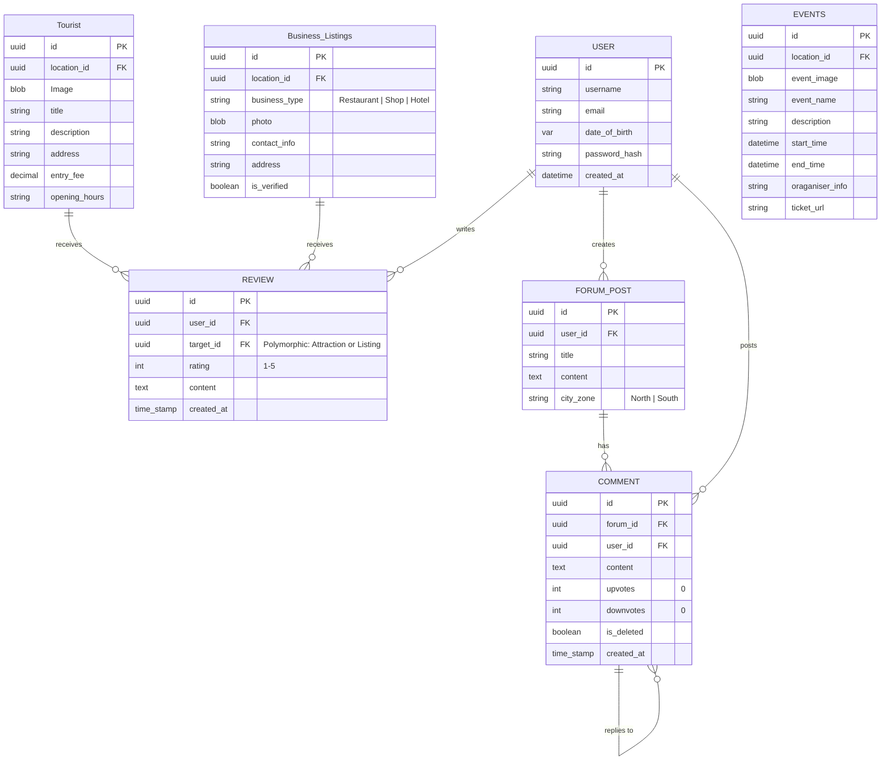
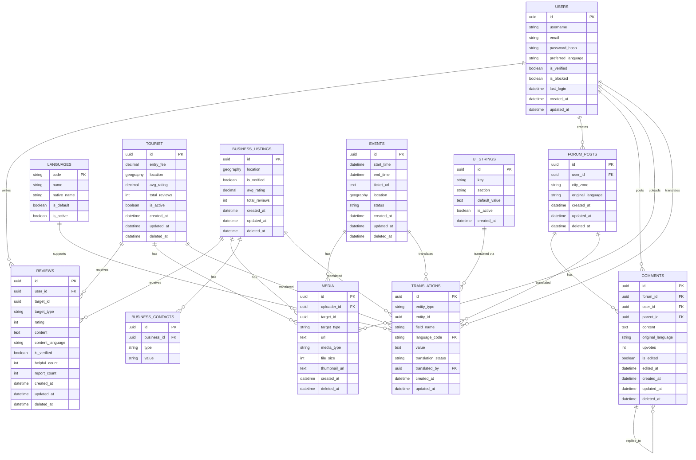

# Database Design



## Database design with Translation (JSON Data)



## Database Design with Translation (Diff translation tables for each table)

```mermaid
erDiagram

  %% ─── USERS ───────────────────────────────────────────────────
  USER ||--o{ REVIEW : writes
  USER ||--o{ FORUM_POST : creates
  USER ||--o{ COMMENT : posts

  USER {
    uuid id PK
    string username
    string email
    string password_hash
    string preferred_language "en | te | hi"
    datetime created_at
    timestamp updated_at
  }

  %% ─── LANGUAGE ─────────────────────────────────────────────────
  LANGUAGE {
    string code PK "en | te | hi"
    string name "English | Telugu | Hindi"
    string native_name "English | తెలుగు | हिन्दी"
    boolean is_default
    boolean is_active
  }

  %% ─── LOCATION (base — universal data only) ───────────────────
  LOCATION ||--o{ LOCATION_TRANSLATION : has
  LOCATION ||--o{ ATTRACTION : contains
  LOCATION ||--o{ LISTING : contains
  LOCATION ||--o{ EVENT : hosts

  LOCATION {
    uuid id PK
    float latitude
    float longitude
    string category_type "attraction | business | event"
    timestamp created_at
    timestamp updated_at
  }

  %% replaces LOCATION_EN + LOCATION_TE + LOCATION_HI
  LOCATION_TRANSLATION {
    uuid id PK
    uuid location_id FK
    string language_code FK "en | te | hi"
    string name
    string address
    timestamp created_at
    timestamp updated_at
  }

  %% ─── ATTRACTION (base — universal data only) ─────────────────
  ATTRACTION ||--o{ ATTRACTION_TRANSLATION : has
  ATTRACTION ||--o{ REVIEW : receives

  ATTRACTION {
    uuid id PK
    uuid location_id FK
    decimal entry_fee "same in all languages"
    string photo_url "same in all languages"
    string opening_hours "same in all languages"
    timestamp created_at
    timestamp updated_at
    timestamp deleted_at
  }

  %% replaces ATTRACTION_EN + ATTRACTION_TE + ATTRACTION_HI
  ATTRACTION_TRANSLATION {
    uuid id PK
    uuid attraction_id FK
    string language_code FK "en | te | hi"
    string title
    string description
    string address
    timestamp created_at
    timestamp updated_at
  }

  %% ─── LISTING / BUSINESS (base — universal data only) ─────────
  LISTING ||--o{ LISTING_TRANSLATION : has
  LISTING ||--o{ REVIEW : receives

  LISTING {
    uuid id PK
    uuid location_id FK
    string contact_info "phone/email — not translated"
    string photo_url "same in all languages"
    boolean is_verified
    timestamp created_at
    timestamp updated_at
    timestamp deleted_at
  }

  %% replaces LISTING_EN + LISTING_TE + LISTING_HI
  LISTING_TRANSLATION {
    uuid id PK
    uuid listing_id FK
    string language_code FK "en | te | hi"
    string name
    string business_type
    string address
    string description
    timestamp created_at
    timestamp updated_at
  }

  %% ─── EVENT (base — universal data only) ──────────────────────
  EVENT ||--o{ EVENT_TRANSLATION : has

  EVENT {
    uuid id PK
    uuid location_id FK
    datetime start_time "not translated"
    datetime end_time "not translated"
    string ticket_url "not translated"
    string event_image_url "not translated"
    timestamp created_at
    timestamp updated_at
    timestamp deleted_at
  }

  %% replaces EVENT_EN + EVENT_TE + EVENT_HI
  EVENT_TRANSLATION {
    uuid id PK
    uuid event_id FK
    string language_code FK "en | te | hi"
    string event_name
    string description
    string organiser_info
    timestamp created_at
    timestamp updated_at
  }

  %% ─── REVIEW ──────────────────────────────────────────────────
  %% User-generated — stored as written, not translated by the system
  REVIEW {
    uuid id PK
    uuid user_id FK
    uuid target_id FK
    string target_type "attraction | listing"
    string language_code "en | te | hi — language it was written in"
    int rating "1-5 — universal"
    text content
    timestamp created_at
    timestamp updated_at
    timestamp deleted_at
  }

  %% ─── FORUM POST ───────────────────────────────────────────────
  FORUM_POST ||--o{ COMMENT : has

  FORUM_POST {
    uuid id PK
    uuid user_id FK
    string language_code "en | te | hi — language authored in"
    string city_zone "North | South | Central"
    string title
    text content
    timestamp created_at
    timestamp updated_at
    timestamp deleted_at
  }

  %% ─── COMMENT ─────────────────────────────────────────────────
  COMMENT ||--o{ COMMENT : replies_to

  COMMENT {
    uuid id PK
    uuid forum_id FK
    uuid user_id FK
    uuid parent_id FK "NULL if top-level reply"
    string language_code "en | te | hi — language written in"
    text content
    int upvotes
    int downvotes
    boolean is_deleted
    timestamp created_at
    timestamp updated_at
  }

  %% ─── UI STRINGS (frontend labels, buttons, nav, errors) ──────
  UI_STRING ||--o{ UI_STRING_TRANSLATION : has

  UI_STRING {
    uuid id PK
    string key "e.g. nav.home | btn.submit | error.required"
    string section "nav | buttons | errors | labels | placeholders"
    string default_value "English fallback — always populated"
    boolean is_active
    timestamp created_at
  }

  UI_STRING_TRANSLATION {
    uuid id PK
    uuid ui_string_id FK
    string language_code FK "en | te | hi"
    string value "translated label"
    string status "draft | approved"
    timestamp created_at
    timestamp updated_at
  }
  ```

## Database Design with Translation (One Translatiion table for the database)

```mermaid
    erDiagram
    USERS ||--o{ REVIEWS : writes
    USERS ||--o{ FORUM_POSTS : creates
    USERS ||--o{ COMMENTS : posts
    USERS ||--o{ MEDIA : uploads
    USERS ||--o{ TRANSLATIONS : translates

    LANGUAGES ||--o{ TRANSLATIONS : supports

    TOURIST ||--o{ REVIEWS : receives
    TOURIST ||--o{ MEDIA : has
    TOURIST ||--o{ TRANSLATIONS : translated

    BUSINESS_LISTINGS ||--o{ REVIEWS : receives
    BUSINESS_LISTINGS ||--o{ MEDIA : has
    BUSINESS_LISTINGS ||--o{ BUSINESS_CONTACTS : has
    BUSINESS_LISTINGS ||--o{ TRANSLATIONS : translated

    EVENTS ||--o{ MEDIA : has
    EVENTS ||--o{ TRANSLATIONS : translated

    FORUM_POSTS ||--o{ COMMENTS : has
    FORUM_POSTS ||--o{ TRANSLATIONS : translated

    COMMENTS ||--o{ COMMENTS : replies_to
    UI_STRINGS ||--o{ TRANSLATIONS : "translated via"

    %% USERS
    USERS {
        uuid id PK
        string username
        string email
        string password_hash
        string preferred_language
        boolean is_verified
        boolean is_blocked
        datetime last_login
        datetime created_at
        datetime updated_at
    }

    %% LANGUAGES
    LANGUAGES {
        string code PK
        string name
        string native_name
        boolean is_default
        boolean is_active
    }

    %% TRANSLATIONS (Improved)
    TRANSLATIONS {
        uuid id PK
        string entity_type
        uuid entity_id
        string field_name
        string language_code FK
        text value
        string translation_status
        uuid translated_by FK
        datetime created_at
        datetime updated_at
    }

    %% UI STRINGS
    UI_STRINGS {
        uuid id PK
        string key
        string section
        text default_value
        boolean is_active
        datetime created_at
    }

    %% TOURIST
    TOURIST {
        uuid id PK
        decimal entry_fee
        geography location
        decimal avg_rating
        int total_reviews
        boolean is_active
        datetime created_at
        datetime updated_at
        datetime deleted_at
    }

    %% BUSINESS LISTINGS
    BUSINESS_LISTINGS {
        uuid id PK
        geography location
        boolean is_verified
        decimal avg_rating
        int total_reviews
        datetime created_at
        datetime updated_at
        datetime deleted_at
    }

    %% BUSINESS CONTACTS
    BUSINESS_CONTACTS {
        uuid id PK
        uuid business_id FK
        string type
        string value
    }

    %% EVENTS
    EVENTS {
        uuid id PK
        datetime start_time
        datetime end_time
        text ticket_url
        geography location
        string status
        datetime created_at
        datetime updated_at
        datetime deleted_at
    }

    %% REVIEWS
    REVIEWS {
        uuid id PK
        uuid user_id FK
        uuid target_id
        string target_type
        int rating
        text content
        string content_language
        boolean is_verified
        int helpful_count
        int report_count
        datetime created_at
        datetime updated_at
        datetime deleted_at
    }

    %% FORUM POSTS
    FORUM_POSTS {
        uuid id PK
        uuid user_id FK
        string city_zone
        string original_language
        datetime created_at
        datetime updated_at
        datetime deleted_at
    }

    %% COMMENTS
    COMMENTS {
        uuid id PK
        uuid forum_id FK
        uuid user_id FK
        uuid parent_id FK
        text content
        string original_language
        int upvotes
        boolean is_edited
        datetime edited_at
        datetime created_at
        datetime updated_at
        datetime deleted_at
    }

    %% MEDIA
    MEDIA {
        uuid id PK
        uuid uploader_id FK
        uuid target_id
        string target_type
        text url
        string media_type
        int file_size
        text thumbnail_url
        datetime created_at
        datetime deleted_at
    }
```
