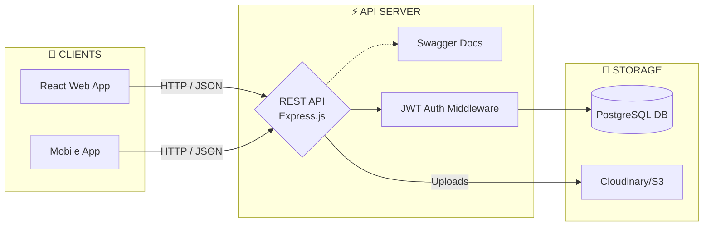

# System Design

## Mermaid Tool

This is an Architecture Diagram, and it’s the big picture of how your project actually works.

## Architecture Diagram

```mermaid
graph LR
    subgraph Clients ["📱 CLIENTS"]
        A[React Web App]
        B[Mobile App]
    end

    subgraph Server ["⚡ API SERVER"]
        C{REST API<br/>Express.js}
        D[Swagger Docs]
        E[JWT Auth Middleware]
    end

    subgraph Storage ["💾 STORAGE"]
        F[(PostgreSQL DB)]
        G[Cloudinary/S3]
    end

    A -- "HTTP / JSON" --> C
    B -- "HTTP / JSON" --> C
    C -.-> D
    C --> E
    E --> F
    C -- "Uploads" --> G
```