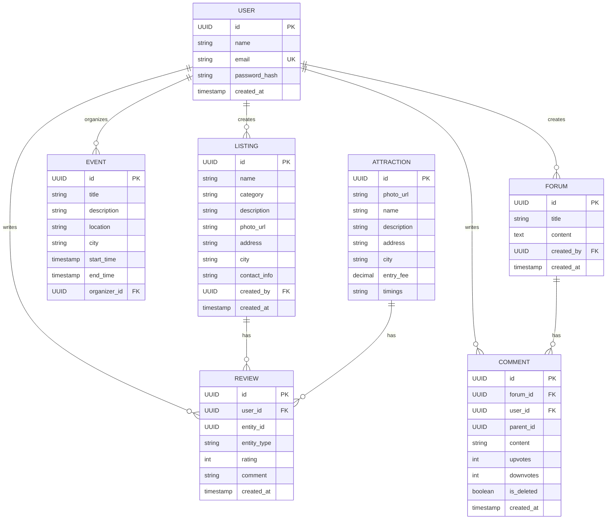

# Database Design

# City Explorer ER Diagram


# API Design

# Authentication APIs

## Register

**POST** `/auth/register`

```json
{
  "name": "John Doe",
  "email": "john@example.com",
  "password": "password123"
}
```

Responses:

* 201 Created
* 400 Bad Request
* 409 Email already exists

---

## Login

**POST** `/auth/login`

```json
{
  "email": "john@example.com",
  "password": "password123"
}
```

Responses:

* 200 OK (returns JWT)
* 401 Unauthorized

---

# Users APIs

## Get User Profile

**GET** `/users/{id}`

## Update User

**PUT** `/users/{id}`

---

#  Listings APIs

## Create Listing

**POST** `/listings`

```json
{
  "name": "Cafe Delhi",
  "category": "restaurant",
  "description": "Nice place",
  "photo_url": "https://image.com",
  "address": "Connaught Place",
  "city": "Delhi",
  "contact_info": "9876543210"
}
```

---

## Get Listings

**GET** `/listings?city=Delhi&category=restaurant&page=1&limit=10`

---

## Get Listing by ID

**GET** `/listings/{id}`

---

## Update Listing

**PUT** `/listings/{id}`

---

## Delete Listing

**DELETE** `/listings/{id}`

---

#  Events APIs

## Create Event

**POST** `/events`

```json
{
  "title": "Music Fest",
  "description": "Live concert",
  "location": "Delhi Stadium",
  "city": "Delhi",
  "start_time": "2026-04-01T18:00:00",
  "end_time": "2026-04-01T22:00:00"
}
```

---

## Get Events

**GET** `/events?city=Delhi&date=2026-04-01`

---

## Get Event by ID

**GET** `/events/{id}`

---

## Update Event

**PUT** `/events/{id}`

---

## Delete Event

**DELETE** `/events/{id}`

---

# Attractions APIs

## Create Attraction (Admin)

**POST** `/attractions`

---

## Get Attractions

**GET** `/attractions?city=Delhi`

---

## Get Attraction by ID

**GET** `/attractions/{id}`

---

# Reviews APIs

## Add Review

**POST** `/reviews`

```json
{
  "entity_id": "uuid",
  "entity_type": "listing", 
  "rating": 5,
  "comment": "Great place!"
}
```

---

## Get Reviews

**GET** `/reviews?entity_id={id}&type=listing`

---

## Update Review

**PUT** `/reviews/{id}`

---

## Delete Review

**DELETE** `/reviews/{id}`

---

# Forums APIs

## Create Forum

**POST** `/forums`

```json
{
  "title": "Best cafes in Delhi?",
  "content": "Looking for suggestions"
}
```

---

## Get Forums

**GET** `/forums?city=Delhi`

---

## Get Forum Details

**GET** `/forums/{id}`

---

## Delete Forum

**DELETE** `/forums/{id}`

---

# Comments APIs (Nested)

## Add Comment

**POST** `/comments`

```json
{
  "forum_id": "uuid",
  "content": "Try XYZ cafe",
  "parent_id": null
}
```

---

## Reply to Comment

```json
{
  "forum_id": "uuid",
  "content": "Yes it's good",
  "parent_id": "comment_id"
}
```

---

## Get Comments (Threaded)

**GET** `/comments?forum_id={id}`

---

## Upvote Comment

**POST** `/comments/{id}/upvote`

---

## Downvote Comment

**POST** `/comments/{id}/downvote`

---

## Delete Comment (Soft Delete)

**DELETE** `/comments/{id}`

Response:

```json
{
  "message": "Comment deleted"
}
```

---

# Search API

## Global Search

**GET** `/search?q=cafe&city=Delhi`

Search across:

* Listings
* Attractions
* Events

---


---