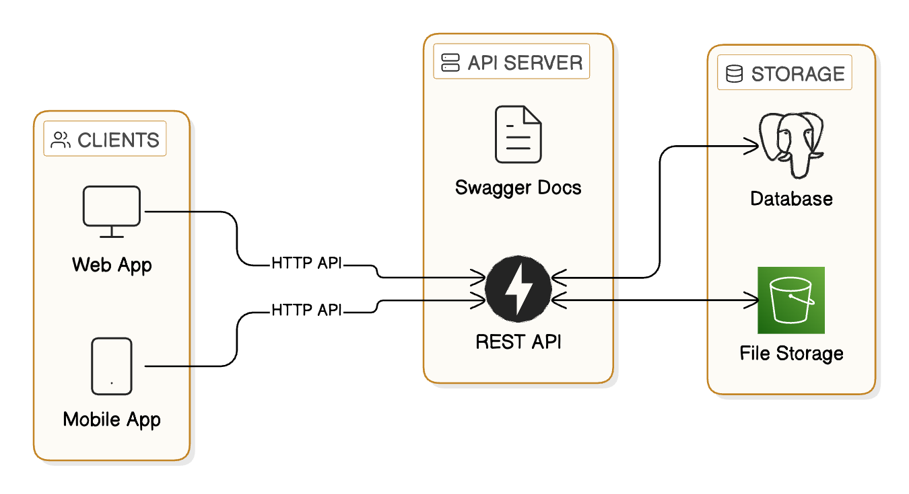

# System Design

Design a City Explorer system with emphasis on:
- Events
- Listings and Directory
- Forums and comments
- Tourist attractions
- Social Ratings and reviews for Listings and Tourist attractions

## Overall system design tools

How does the system work and tools that you can use
- Eraser.io 
- Mermaid
- Draw.io
- Miro 

### Example from Eraser

Exercise:

Do the same architecture in other tools

## High level architecture design

- Database design (dos and donts)
- API design
- Scalability

### Database design

Design the database tables and include the ER diagram with any of the tools mentioned above

### API design

How does the CRUD and other operations look like and what errors are to be taken care of

